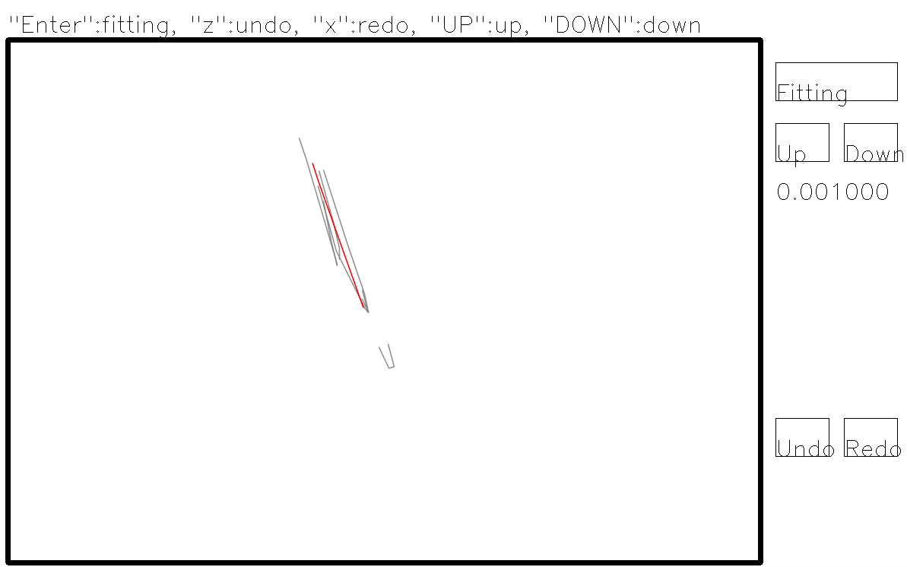
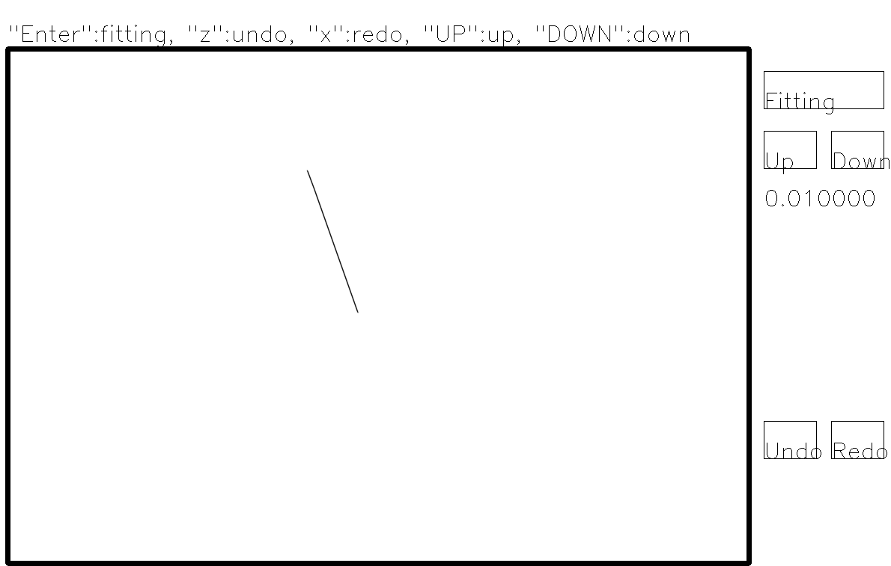
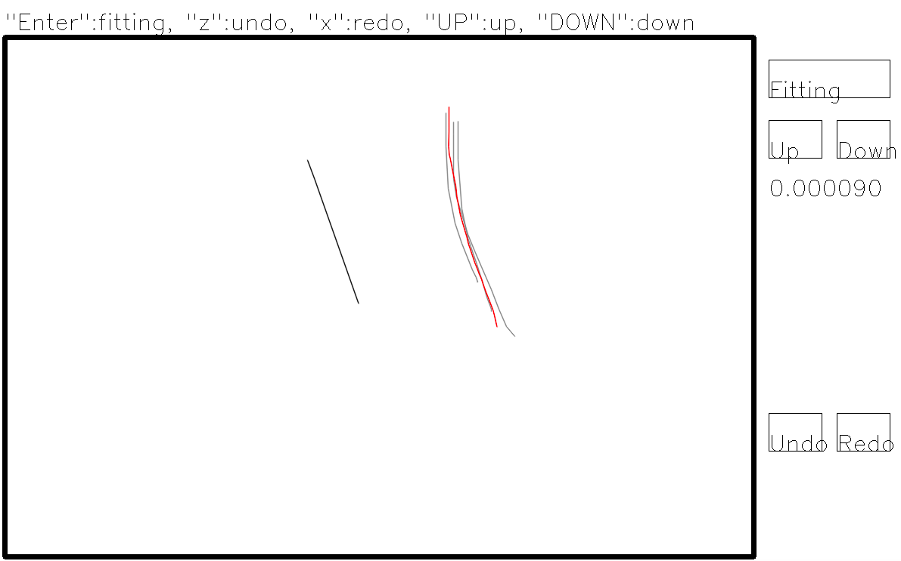
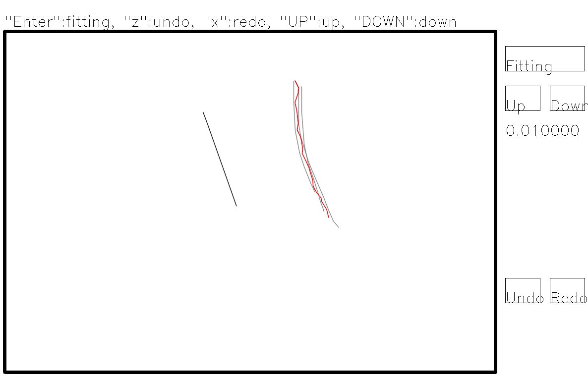

## Curves fitting
このプログラムは https://www.cs.ubc.ca/labs/imager/tr/2018/StrokeAggregator/ の 5 Fitting を参考にして作った
複数の曲線を一本の曲線にfittingするプログラムです。 
MLS法(移動最小二乗法)を用いており、アルゴリズムは論文に書いてある通り
http://citeseerx.ist.psu.edu/viewdoc/download?doi=10.1.1.103.6770&rep=rep1&type=pdf
の手法を用いてます。 
(実行時に注意事項は大事だったりします)

### 実行環境
- Mac OS Sierra 10.12.6
- gcc 6.5.0
- opencv 4.1.0
- Eigen3
- CMake(3.8.2)

### 環境構築
以下のライブラリを用いています 
- Eigen3
- OpenCV

まずはコードのクローンを行う 
`$ git clone https://github.com/whim0547/StorkeAggregator-fitting.git`

EigenやOpenCVのインクルードパスはCMakeFile.txtから各自設定してください。 
以下の部分を変更すれば良いはずです。 
`find_package( OpenCV REQUIRED )
include_directories( ${OpenCV_INCLUDE_DIRS} )
include_directories( /usr/local/include/eigen3 )`

cmakeを行う 
`$ cd
$ mkdir build
$ cd build
$ cmake ..`

### 実行方法
cmakeが終わればbuildディレクトリでmakeを行う 
`$ make`
makeが完了すれば以下で実行できます。
`$ ./main`

### 操作方法
#### 線の引き方
キャンバスの四角内部でマウスを(左ボタンで)ドラッグすることで線を引けます(青の線)。 
マウス左クリック+ドラッグ機能があれば板タブレットでも動作します(多分)。 
引いた線はグレーの線になります。

#### Fittingのやり方
線を複数引いてからfittingマスを左クリックするかEnterキーを押すことで(グレーの線群に対して)Fittingが動きます。 

そこで表示される曲線(赤の曲線)でよければもう一度クリックまたはEnterキーを押してください(黒の線になる)。 

#### その他
##### Fittingの具合の調整
Up/Downマスの下にある数字はFittingでの元曲線たちに対する追従度であり、 
小さいほど滑らかになり 

大きいほど元の曲線(のポリライン頂点)に近い点を通るようになります。 

Up/Downマスまたは対応方向キーを押せば値を上下させることができ、 
Fitting曲線が表示されている間はその値に追従します。

##### Undo/Redo
Undo/Redoマスまたはz/xキーを押すことで元に戻す/やり直すの操作を行うことができます。 
しかし、引かれた曲線が消える/現れるだけなのでFittingのやり直しはできないので注意。 
Fitting曲線が表示されている間に元に戻すを行うとFitting前の状態になります。

### 注意事項
- 曲線はポリライン曲線を用いているため、頂点数が多いときは計算時間が長くなります
  - 長くゆっくり書いたりするのは避けてください
  - もしくはcv.cppでdelay_counterをint型にしてmouse_callbackで一定間隔(2でmodをとるなど)になるように調整してください
- fittingする曲線同士の間隔はできるだけ小さめにしてください
- はみ出た曲線があるとそちらに追従されすぎる可能性があります
- 曲線同士を平行にしすぎると時間がかかる場合があります
- 計算量のボトルネックはMLSの実装にあります
